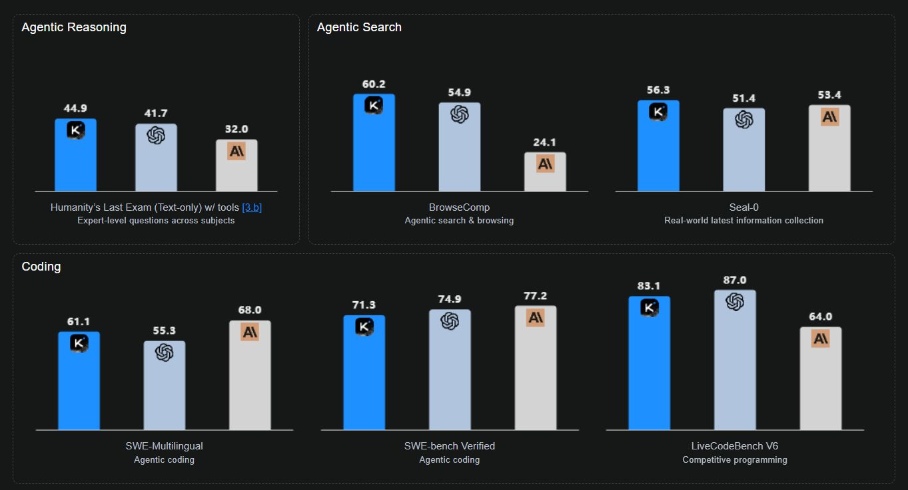

# November 14, 2025

𝐒𝐡𝐨𝐮𝐥𝐝 𝐲𝐨𝐮 𝐮𝐬𝐞 𝐂𝐡𝐢𝐧𝐞𝐬𝐞 𝐋𝐋𝐌𝐬 𝐢𝐧 𝐲𝐨𝐮𝐫 𝐛𝐮𝐬𝐢𝐧𝐞𝐬𝐬?

Moonshot AI, a Chinese research lab, recently released an update to its Kimi model. It's not just reaching the state of the art; it's even beating leading models like GPT-5 (High) and Claude Sonnet 4.5 in a few benchmarks. Earlier this year, the same lab released the initial Kimi K2 model. While it didn't make huge waves, for me, it was a "DeepSeek moment" because Kimi K2 was, and still is, one of the best models for tool calling. This is hugely significant, as the ability to call tools is critical when using a model in an agentic system. With its enhanced reasoning capabilities, the updated Kimi K2 thinking is now very good at web research, where the model has to perform tool calls for Google searches and then use its intelligence to reason about the results. Kimi K2 is intelligent, capable, fast, relatively cheap, and open-source.

𝐓𝐡𝐢𝐬 𝐛𝐫𝐢𝐧𝐠𝐬 𝐮𝐩 𝐚𝐧 𝐢𝐦𝐩𝐨𝐫𝐭𝐚𝐧𝐭 𝐪𝐮𝐞𝐬𝐭𝐢𝐨𝐧: 𝐬𝐡𝐨𝐮𝐥𝐝 𝐲𝐨𝐮 𝐮𝐬𝐞 𝐭𝐡𝐞𝐬𝐞 𝐂𝐡𝐢𝐧𝐞𝐬𝐞 𝐨𝐩𝐞𝐧-𝐬𝐨𝐮𝐫𝐜𝐞 𝐦𝐨𝐝𝐞𝐥𝐬?

In my experience, many product owners and managers don't fully grasp the technical reality of how LLMs are hosted. They hear "Chinese model" and immediately think their data is at risk. But in many cases, the reality is that if you host an open-source model on your own or rented hardware (e.g., on Azure), your data is much safer than when using closed-source models from providers like OpenAI or Anthropic. Another reality is that these open-source models are not always easily available as pay-per-use services on platforms like Azure, especially with the restriction that they must be hosted in Europe. However, as AI progresses and open-source models gain popularity, their availability on hyperscalers is bound to increase.

𝐐𝐮𝐞𝐬𝐭𝐢𝐨𝐧: 𝐖𝐨𝐮𝐥𝐝 𝐲𝐨𝐮 𝐮𝐬𝐞 𝐂𝐡𝐢𝐧𝐞𝐬𝐞 𝐨𝐩𝐞𝐧-𝐬𝐨𝐮𝐫𝐜𝐞 𝐋𝐋𝐌𝐬 𝐢𝐧 𝐲𝐨𝐮𝐫 𝐜𝐨𝐦𝐩𝐚𝐧𝐲'𝐬 𝐩𝐫𝐨𝐣𝐞𝐜𝐭𝐬? Let me know in the comments.
