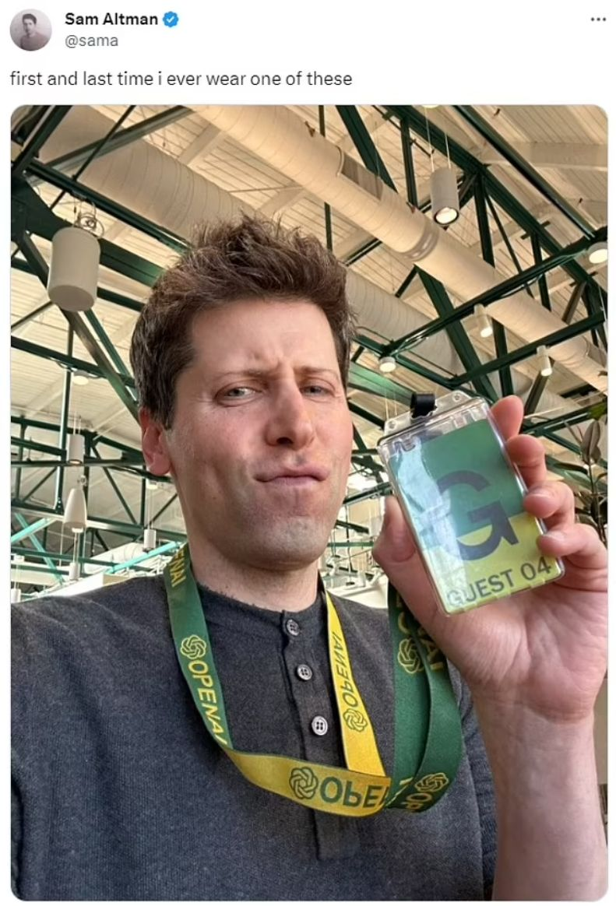

# November 12, 2025

I am getting the popcorn 🍿 back out. Remember: almost two years ago, Sam Altman got fired as the CEO of OpenAI. Here is what happened:

- **November 17, 2023:** Sam Altman suddenly fired; Mira Murati appointed interim CEO. Greg Brockman removed as chairman then quits.
- **November 18, 2023:** Investors pressure the board for Altman's return.
- **November 19, 2023:** Emmett Shear (Twitch cofounder) becomes interim CEO as Altman return talks fail.
- **November 20, 2023:** Microsoft hires Altman and Brockman. Majority of employees threaten (via Tweets) to quit.
- **November 22, 2023:** Altman reinstated as CEO. New initial board formed.

For over a year, that was the story. Now, a deposition from co-founder and former Chief Scientist Ilya Sutskever, a key player in the ouster, gives us a look behind the curtain. Here are the most interesting bits from his testimony:

🤫 **A Year in the Making:** This was no snap decision. Sutskever revealed he had been considering the need for Altman's removal for "at least a year."

📝 **The Secret Memo:** He authored a 52-page memo accusing Altman of a "consistent pattern of lying, undermining his execs, and pitting his execs against one another." This memo was shared only with the independent directors.

💨 **Calculated Secrecy:** Why the secrecy? Sutskever feared that if Altman knew about the discussions, he would "find a way to make them disappear." The memo was even sent using a disappearing email link.

🎯 **The Goal Was Clear:** When asked what action he wanted the board to take, Sutskever's one-word answer was unequivocal: "Termination."

🤔 **A "Rushed" Process:** Despite the long-term planning, Sutskever now reflects that the process was "rushed" and handled by a board he felt was "inexperienced in board matters."

This wasn't just a communication breakdown; it was a premeditated, covert campaign to remove a CEO, born from long-standing mistrust. It raises critical questions about governance and power dynamics at the heart of the AI revolution.

**My Opinion:** Maybe Ilya was right to try to get rid of Sam Altman. Because OpenAI's mission was supposed to be "ensuring that artificial general intelligence benefits all of humanity", and now they converted from a non-profit to a for-profit structure, and they focus on making money (with AI slop Videos and Adult chatbots) instead of benefiting humanity.

#OpenAI #SamAltman #IlyaSutskever #AIEthics #Leadership #TechDrama #CorporateGovernance #ArtificialIntelligence

*In the picture, Sam Altman is proudly showing off his Guest Pass as he returns to OpenAI as CEO 4 days after being fired.*
