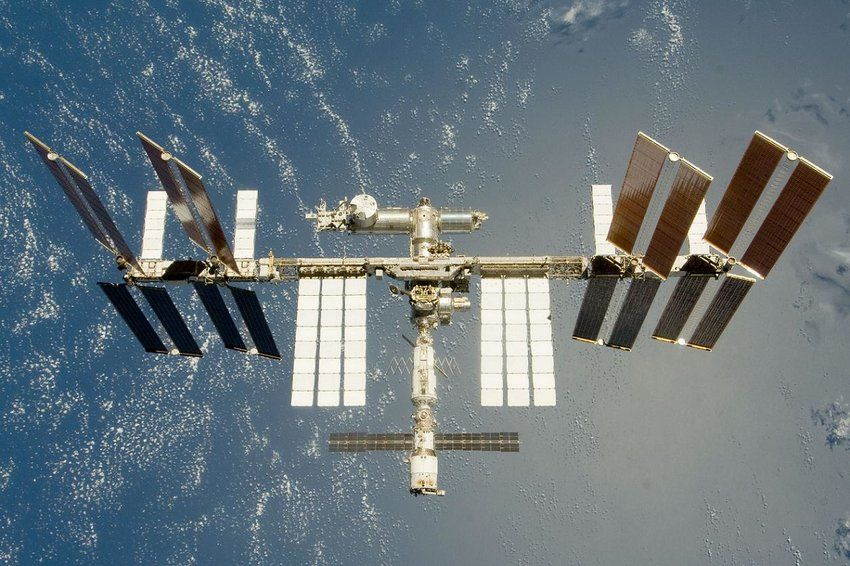

# November 18, 2025

They want to put servers in Space for training and hosting LLMs???? Yes, they are thinking about it, and the science is crazy! (it involves space lasers!)

Google's "Project Suncatcher" is a true moonshot initiative that tackles the biggest challenge for the future of AI: its insatiable energy demand. Instead of building more data centers on Earth, they're looking up. The idea is to create a massive AI infrastructure in orbit, powered by the sun. But how would that even work? The challenges are astronomical, but so are the solutions they've proposed.

🛰️ **Challenge 1: Data Speed** — How do you get the lightning-fast, low-latency connection of a terrestrial data center in space? **The Solution:** Fly a massive constellation of satellites in an incredibly tight formation (within a 1km radius!) and connect them with high-speed lasers (free-space optics) capable of terabits per second.

🚀 **Challenge 2: Launch Costs** — Isn't launching things into orbit prohibitively expensive? **The Solution:** Bet on the future. Google's analysis shows that with reusable rockets like Starship, launch costs could plummet to under $200/kg by the mid-2030s. At that price, the cost of power in space becomes competitive with what data centers pay for electricity on the ground.

☢️ **Challenge 3: Radiation** — Won't the harsh radiation of space destroy the sensitive AI chips? **The Solution:** They tested it. Google's Tensor Processing Units (TPUs) were blasted with radiation and survived a simulated 5-year mission in Low Earth Orbit without permanent damage.

But the most fascinating challenge is the one everyone gets wrong: **heat.**

🔥 **The Misconception of "Cold" Space** — Movies have done their part here. We all remember the scene in Avengers: Infinity War where a villain is blown out of an airlock and instantly freezes solid. That's not how physics works. The vacuum of space is a perfect insulator. With no air to transfer heat to, getting rid of it is incredibly difficult. An unprotected object in direct sunlight would actually overheat, not freeze.

**The Real Solution: Giant Radiators** — For every watt of power the solar panels generate and the TPUs consume, a watt of waste heat is created. To dissipate this, Google's design requires a massive surface area of dedicated radiators. My analysis of their paper shows a fascinating ratio: for every 1 square meter of solar panel, they need approximately 0.82 square meters of high-tech radiator surface just to beam that heat away as infrared radiation.

This isn't just a wild idea; it's a bold engineering proposal that rethinks the very foundation of our digital world. It's a glimpse into a future where our computational needs are met not by straining our planet's resources, but by reaching for the stars. What do you think? Is this the future of AI infrastructure?

#ProjectSuncatcher #Google #AI #SpaceTech #DataCenter #Sustainability #Engineering #Innovation

*Image: Notice the big flat white panels on the ISS. They are not solar panels, they are heat radiators.*
