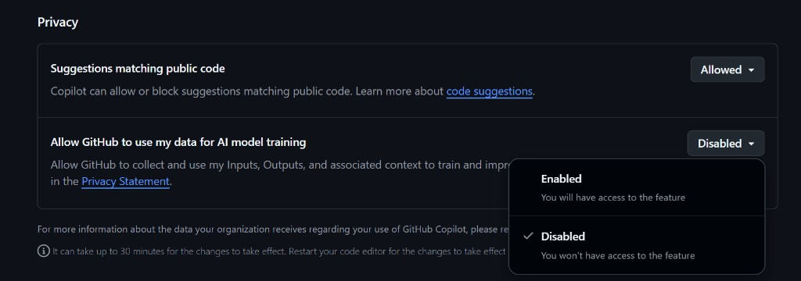

# 28. März 2026

Ab dem 24. April gehören eure Copilot-Chats GitHub.
Opt-out geht – aber nur wenn ihr jetzt aktiv werdet.

GitHub hat angekündigt: Wer Copilot Free, Pro oder Pro+ verwendet, dessen Eingaben, Outputs und Code-Kontext werden ab dann automatisch für das Training von KI-Modellen genutzt – sofern ihr nicht vorher widersprecht.

Ich hab's bei mir gerade nachgeschaut: Bei mir stand es noch auf "Disabled". Wer die Einstellung nie bewusst gesetzt hat, wird ab April automatisch eingeschrieben.

Was du jetzt tun solltest:

→ Prüft das Setting jetzt: github.com/settings/copilot/features
→ Stellt euch für den 24. April einen Kalender-Reminder – und prüft dann nochmal, ob die Einstellung wirklich noch auf Disabled steht
→ Taggt eure Kollegen in den Kommentaren, damit auch sie Bescheid wissen

Hinweis: Copilot Business und Copilot Enterprise sind davon nicht betroffen.

Quelle: github.blog/news-insights/company-news/updates-to-github-copilot-interaction-data-usage-policy

